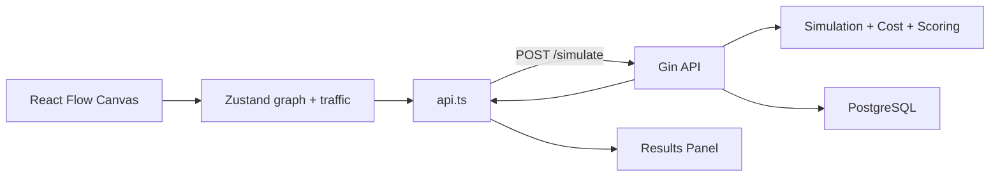

# ScaleForge

ScaleForge is a gamified infrastructure architecture simulator. Engineers can visually design distributed systems on a canvas, define traffic profiles, and run simulations to estimate latency, throughput, cost, bottlenecks, and architecture scores.

## Architecture

```text
scaleforge/
├── backend/          # Go + Gin API (simulation, cost, scoring engines)
├── frontend/         # Bun + Vite + React + TypeScript
├── docker-compose.yml
├── Makefile
└── spec.md           # Product requirements
```



## Tech Stack

| Layer    | Technology |
|----------|------------|
| Backend  | Go, Gin, pgx, golang-migrate |
| Frontend | Bun, Vite, React, TypeScript, React Flow, Zustand, TanStack Query, Tailwind CSS, Framer Motion |
| Database | PostgreSQL 16 |

## Prerequisites

- [Go 1.22+](https://go.dev/dl/)
- [Bun 1.1+](https://bun.sh/)
- [Docker](https://www.docker.com/) (for PostgreSQL)

## Quick Start

### 1. Start PostgreSQL

```bash
docker compose up -d postgres
```

Adminer is available at http://localhost:8081 (user: `scaleforge`, password: `scaleforge`, database: `scaleforge`).

### 2. Configure environment

```bash
cp backend/.env.example backend/.env
cp frontend/.env.example frontend/.env
```

### 3. Run the backend

```bash
cd backend
go mod download
go run ./cmd/server
```

The API starts at http://localhost:8080. Migrations run automatically on startup.

### 4. Run the frontend

```bash
cd frontend
bun install
bun run dev
```

Open http://localhost:5173.

### Using Make

```bash
make db-up      # Start Postgres + Adminer
make backend    # Run Go API
make frontend   # Run Vite dev server
```

## Demo Scenario

Click **Load demo** in the UI to populate the interview scenario from the spec:

```text
Cloudflare → Load Balancer → Go API (3 replicas) → Redis → PostgreSQL
```

Traffic: 50,000 daily users, 5,000 concurrent, 2 req/user/min, 1.5x peak.

Expected results (approximate):

| Metric     | Value        |
|------------|--------------|
| Latency    | ~31 ms       |
| Capacity   | ~1,500 RPS   |
| Cost       | ~$210/month  |
| Bottleneck | PostgreSQL   |
| Grade      | A-           |

## API Reference

| Method | Endpoint              | Description                    |
|--------|-----------------------|--------------------------------|
| GET    | `/health`             | Health check + DB ping         |
| GET    | `/catalog`            | Node type definitions          |
| POST   | `/architectures`      | Create architecture            |
| GET    | `/architectures`      | List architectures             |
| GET    | `/architectures/:id`  | Get architecture               |
| PUT    | `/architectures/:id`  | Update architecture            |
| DELETE | `/architectures/:id`  | Delete architecture            |
| POST   | `/simulate`           | Run simulation                 |
| GET    | `/simulation/:id`     | Get saved simulation result    |

### Simulate request example

```json
{
  "graph": {
    "nodes": [
      {
        "id": "go-1",
        "type": "go_service",
        "label": "Go API",
        "position": { "x": 0, "y": 0 },
        "config": { "cpu": 2, "memory": 4, "replicas": 3, "autoscaling": true }
      }
    ],
    "edges": []
  },
  "traffic": {
    "dailyActiveUsers": 50000,
    "monthlyActiveUsers": 150000,
    "concurrentUsers": 5000,
    "requestsPerUserMin": 2,
    "peakTrafficMultiplier": 1.5
  }
}
```

## Project Structure

### Backend

```text
backend/
├── cmd/server/main.go
├── internal/
│   ├── config/
│   ├── transport/http/          # HTTP layer (Gin handlers + router)
│   │   ├── router.go
│   │   ├── architecture_handler.go
│   │   └── simulation_handler.go
│   ├── catalog/                 # Node catalog service + models
│   ├── simulation/              # Simulation engine + service + models
│   ├── scoring/                 # Architecture scorer + models
│   ├── cost/                    # Cost calculator + models
│   ├── repository/              # Repository interfaces
│   │   ├── interfaces.go
│   │   └── postgres/
│   │       ├── store.go
│   │       ├── architecture.go
│   │       └── simulation.go
│   ├── middleware/
│   └── migrate/
└── Dockerfile
```

### Frontend

```text
frontend/
├── src/
│   ├── features/builder/   # Canvas, palette, config, traffic
│   ├── features/results/   # Simulation results panel
│   ├── store/              # Zustand state
│   ├── lib/api.ts          # API client
│   └── types/              # TypeScript types
└── Dockerfile
```

## Simulation Engine

The backend is the single source of truth for simulation logic:

- **Incoming RPS**: `(concurrentUsers × requestsPerUserMin / 60) × peakMultiplier`
- **Latency**: Sum of base latencies for nodes on the architecture path
- **Capacity**: `min(replicas × perInstanceCapacity × cpuMultiplier)` across nodes
- **Bottleneck**: Node with lowest capacity when incoming RPS exceeds capacity
- **Cost**: Sum of `unitMonthlyCost × replicas` per node

## Backend Architecture

The backend uses a **layered, transport-first** layout:

```text
transport/http  →  services (simulation, catalog, cost, scoring)  →  repository/postgres
       ↑                          ↑                                        ↑
   Gin handlers              business logic                           SQL / pgx
```

| Layer | Package | Role |
|-------|---------|------|
| Transport | `transport/http` | Routing, request binding, JSON responses |
| Services | `simulation`, `catalog`, `cost`, `scoring` | Domain logic; each has `models.go` + engine/service |
| Repository | `repository` + `repository/postgres` | Interfaces + Postgres implementations per aggregate |

Handlers stay thin: architecture CRUD talks to `ArchitectureRepository`; `/simulate` delegates to `simulation.Service`, which orchestrates the engine, cost calculator, scorer, and persistence.

## Authentication

ScaleForge uses stateless **JWT (HS256)** auth with an optional, limited guest mode:

- `POST /auth/signup` and `POST /auth/login` issue a bearer token; passwords are hashed with **bcrypt**.
- `GET /auth/me`, all `/architectures*` routes, and `GET /simulation/:id` require a valid token; `/catalog` and `POST /simulate` are guest-allowed (guest simulations are computed but not persisted).
- Architecture ownership is enforced per authenticated user.

Set `JWT_SECRET` to a strong value in any non-local deployment — the default in `.env.example` is for development only.

## License

Released under the [MIT License](./LICENSE). See the `LICENSE` file for the full text.
