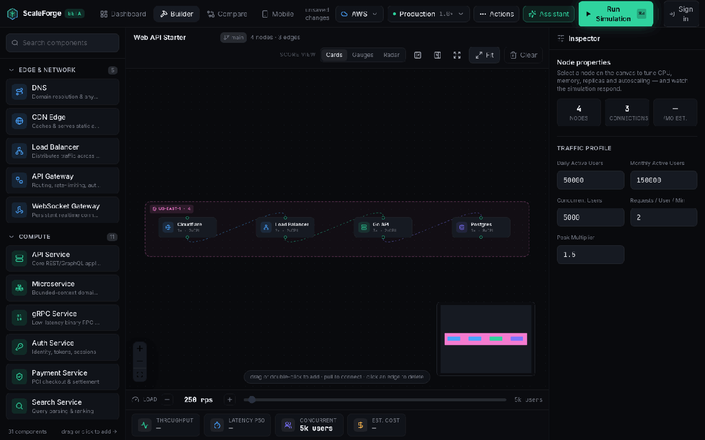
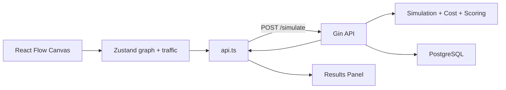
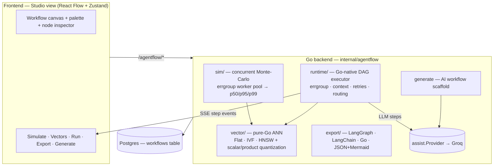

# ScaleForge

[](https://github.com/NavpreetSSidhu/scaleforge/actions/workflows/ci.yml)

ScaleForge is a gamified infrastructure architecture simulator. Engineers can visually design distributed systems on a canvas, define traffic profiles, and run simulations to estimate latency, throughput, cost, bottlenecks, and architecture scores.

<p align="center">
  
</p>

> Build an architecture → run a load simulation → ask the **AI assistant** to improve it (it proposes changes you preview and apply) → **compare languages/runtimes** and cloud providers.

## Architecture

```text
scaleforge/
├── backend/          # Go + Gin API (simulation, cost, scoring engines)
├── frontend/         # Bun + Vite + React + TypeScript
├── docker-compose.yml
├── Makefile
└── spec.md           # Product requirements
```


```mermaid
flowchart LR
  Canvas["React Flow Canvas"] --> Store["Zustand graph + traffic"]
  Store --> ApiClient["api.ts"]
  ApiClient -->|"POST /simulate"| Gin["Gin API"]
  Gin --> Engine["Simulation + Cost + Scoring"]
  Gin --> Postgres["PostgreSQL"]
  Gin --> ApiClient
  ApiClient --> Results["Results Panel"]
```

## Tech Stack

| Layer    | Technology |
|----------|------------|
| Backend  | Go, Gin, pgx, golang-migrate |
| Frontend | Bun, Vite, React, TypeScript, React Flow, Zustand, TanStack Query, Tailwind CSS, Framer Motion |
| Database | PostgreSQL 16 |

## Prerequisites

- [Go 1.22+](https://go.dev/dl/)
- [Bun 1.1+](https://bun.sh/)
- [Docker](https://www.docker.com/) (for PostgreSQL)

## Quick Start

### 1. Start PostgreSQL

```bash
docker compose up -d postgres
```

Adminer is available at http://localhost:8081 (user: `scaleforge`, password: `scaleforge`, database: `scaleforge`).

### 2. Configure environment

```bash
cp backend/.env.example backend/.env
cp frontend/.env.example frontend/.env
```

### 3. Run the backend

```bash
cd backend
go mod download
go run ./cmd/server
```

The API starts at http://localhost:8080. Migrations run automatically on startup.

### 4. Run the frontend

```bash
cd frontend
bun install
bun run dev
```

Open http://localhost:5173.

### Using Make

```bash
make db-up      # Start Postgres + Adminer
make backend    # Run Go API
make frontend   # Run Vite dev server
```

## Demo Scenario

Click **Load demo** in the UI to populate the interview scenario from the spec:

```text
Cloudflare → Load Balancer → Go API (3 replicas) → Redis → PostgreSQL
```

Traffic: 50,000 daily users, 5,000 concurrent, 2 req/user/min, 1.5x peak.

Expected results (approximate):

| Metric     | Value        |
|------------|--------------|
| Latency    | ~31 ms       |
| Capacity   | ~1,500 RPS   |
| Cost       | ~$210/month  |
| Bottleneck | PostgreSQL   |
| Grade      | A-           |

## API Reference

| Method | Endpoint              | Description                    |
|--------|-----------------------|--------------------------------|
| GET    | `/health`             | Health check + DB ping         |
| GET    | `/catalog`            | Node type definitions          |
| GET    | `/runtimes`           | Language/runtime perf coefficients |
| GET    | `/assistant`          | Assistant availability (`{enabled}`) |
| POST   | `/assistant`          | AI architecture assistant (chat) |
| POST   | `/architectures`      | Create architecture            |
| GET    | `/architectures`      | List architectures             |
| GET    | `/architectures/:id`  | Get architecture               |
| PUT    | `/architectures/:id`  | Update architecture            |
| DELETE | `/architectures/:id`  | Delete architecture            |
| POST   | `/simulate`           | Run simulation                 |
| GET    | `/simulation/:id`     | Get saved simulation result    |
| GET    | `/achievements`       | List achievements + unlock state |

### Simulate request example

```json
{
  "graph": {
    "nodes": [
      {
        "id": "go-1",
        "type": "go_service",
        "label": "Go API",
        "position": { "x": 0, "y": 0 },
        "config": { "cpu": 2, "memory": 4, "replicas": 3, "autoscaling": true }
      }
    ],
    "edges": []
  },
  "traffic": {
    "dailyActiveUsers": 50000,
    "monthlyActiveUsers": 150000,
    "concurrentUsers": 5000,
    "requestsPerUserMin": 2,
    "peakTrafficMultiplier": 1.5
  }
}
```

## Project Structure

### Backend

```text
backend/
├── cmd/server/main.go
├── internal/
│   ├── config/
│   ├── transport/http/          # HTTP layer (Gin handlers + router)
│   │   ├── router.go
│   │   ├── architecture_handler.go
│   │   └── simulation_handler.go
│   ├── catalog/                 # Node catalog service + models
│   ├── simulation/              # Simulation engine + service + models
│   ├── scoring/                 # Architecture scorer + models
│   ├── cost/                    # Cost calculator + models
│   ├── repository/              # Repository interfaces
│   │   ├── interfaces.go
│   │   └── postgres/
│   │       ├── store.go
│   │       ├── architecture.go
│   │       └── simulation.go
│   ├── middleware/
│   └── migrate/
└── Dockerfile
```

### Frontend

```text
frontend/
├── src/
│   ├── features/builder/   # Canvas, palette, config, traffic
│   ├── features/results/   # Simulation results panel
│   ├── store/              # Zustand state
│   ├── lib/api.ts          # API client
│   └── types/              # TypeScript types
└── Dockerfile
```

## Simulation Engine

The backend is the single source of truth for simulation logic:

- **Incoming RPS**: `(concurrentUsers × requestsPerUserMin / 60) × peakMultiplier`
- **Latency**: Sum of base latencies for nodes on the architecture path
- **Capacity**: `min(replicas × perInstanceCapacity × cpuMultiplier)` across nodes
- **Bottleneck**: Node with lowest capacity when incoming RPS exceeds capacity
- **Cost**: Sum of `unitMonthlyCost × replicas` per node

## Backend Architecture

The backend uses a **layered, transport-first** layout:

```text
transport/http  →  services (simulation, catalog, cost, scoring)  →  repository/postgres
       ↑                          ↑                                        ↑
   Gin handlers              business logic                           SQL / pgx
```

| Layer | Package | Role |
|-------|---------|------|
| Transport | `transport/http` | Routing, request binding, JSON responses |
| Services | `simulation`, `catalog`, `cost`, `scoring` | Domain logic; each has `models.go` + engine/service |
| Repository | `repository` + `repository/postgres` | Interfaces + Postgres implementations per aggregate |

Handlers stay thin: architecture CRUD talks to `ArchitectureRepository`; `/simulate` delegates to `simulation.Service`, which orchestrates the engine, cost calculator, scorer, and persistence.

## Authentication

ScaleForge uses stateless **JWT (HS256)** auth with an optional, limited guest mode:

- `POST /auth/signup` and `POST /auth/login` issue a bearer token; passwords are hashed with **bcrypt**.
- `GET /auth/me`, all `/architectures*` routes, and `GET /simulation/:id` require a valid token; `/catalog` and `POST /simulate` are guest-allowed (guest simulations are computed but not persisted).
- Architecture ownership is enforced per authenticated user.

Set `JWT_SECRET` to a strong value in any non-local deployment — the default in `.env.example` is for development only.

### Rate limiting

Important endpoints are rate-limited per client IP (in-memory fixed window, `internal/middleware/ratelimit.go`):

| Endpoints | Limit |
|-----------|-------|
| `POST /auth/signup`, `POST /auth/login` | 10 / min (blunts brute-force & enumeration) |
| `POST /simulate`, `POST /compare` | 60 / min (compute-heavy) |
| `POST /assistant` | 10 / min (protects the free LLM quota) |

Over-limit requests get `429 Too Many Requests`. Read-only browsing (`/catalog`, `/pricing`, `/runtimes`) is unthrottled. For a multi-instance deployment this would move to a shared store (e.g. Redis).

## AI Assistant

ScaleForge ships an optional AI assistant that **explains** the current architecture
(grounded in the live simulation numbers) and **proposes concrete changes** you preview
and apply to the canvas.

- Backed by [Groq](https://console.groq.com)'s free, OpenAI-compatible API (default model
  `llama-3.3-70b-versatile`). Set `GROQ_API_KEY` to enable it; the provider is a swappable
  seam (`internal/assist`), so any OpenAI-style endpoint works.
- The model returns a constrained JSON envelope (`{ reply, actions }`). Every action is
  **validated server-side against the catalog and the current graph** before reaching the
  client, so it can never introduce unknown components or dangling references.
- The UI is a slide-in drawer (sparkle button in the top bar, hidden when no key is set).
  Proposed changes appear as chips you **Apply** (or **Apply all**), then auto-resimulate.
- `POST /assistant` is guest-friendly but rate-limited per client to protect the free quota.

## Runtime / language comparison

Compute components can declare the language/runtime they're built in (Go, Rust, Node.js,
Python, Java, C#/.NET). The simulation engine applies per-runtime throughput and latency
factors to compute nodes only — managed services (databases, caches, edge) are unaffected.

The coefficients are a **curated static table** (`internal/runtime`) derived from the public
[TechEmpower Framework Benchmarks](https://www.techempower.com/benchmarks/), normalized to
**Go = 1.0** — so an architecture with no runtime set behaves exactly as before. The Compare
view's **"Across runtimes"** mode ranks runtimes for your architecture and cites its source.

## Learn

The **Learn** tab is a library of pre-authored, animated lessons. Each course is static
content (`frontend/src/data/courses/`): a diagram revealed step-by-step on a read-only React
Flow stage (cumulative node/edge build-up + a spotlight/callout per step) alongside a
markdown lesson panel. Progress is saved per signed-in user; guests can step through freely.

Two flavours, grouped in the catalog:

- **System Design** — courses teaching an infrastructure architecture (load balancing,
  caching, rate limiting, replication, sharding, message queues, distributed logging). Each
  one's design can be loaded onto the builder canvas with **Try it on canvas** and simulated.
- **Low-Level Design (LLD)** — coding courses for classic interview questions: **LRU Cache**,
  **LFU Cache**, **Rate Limiter** (token bucket), and **Parking Lot** (OOD). The stage shows
  an animated class / data-structure diagram while the lesson teaches the implementation in
  **Python** with syntax-highlighted, copyable code; the complete runnable reference solution
  is one click away via **Copy full solution**.

### AI Tutor

When `GROQ_API_KEY` is set, each lesson exposes an optional AI **Tutor** (slide-in drawer,
`internal/tutor`) with two personas — **Teacher** (elaborates on the current step) and
**Q&A** (freeform questions) — both grounded and returned as a constrained `{ reply }`
envelope. The tutor is rate-limited per client; lessons and animations work fully without a
key (the AI entry points are simply hidden).

## Labs

Every other tab in ScaleForge *models* infrastructure. **Labs** runs it. Each lab starts
genuine containers on an isolated Docker network, drops you into a real shell inside that
network, and verifies your progress by querying the live system — not by comparing your
answer to a stored one.

```
Browser                     Go API                      Docker
┌──────────────┐  WebSocket ┌────────────────┐         ┌──────────────────────┐
│  xterm.js    │◄──────────►│ lab.Terminal   │ PTY ───►│ workstation container│
│  terminal    │  (binary)  │ (docker exec)  │         │  aws / kubectl / psql│
├──────────────┤            ├────────────────┤         ├──────────────────────┤
│  objectives  │  POST      │ lab.Verify     │ exec ──►│ service containers   │
│  checklist   │◄──────────►│ (check scripts)│         │  minio / k3s / pg    │
└──────────────┘  /verify   └────────────────┘         └──────────────────────┘
                                                        one network per session
```

**Enable it:** labs hold real memory and pull real images, so they are opt-in.

```bash
LABS_ENABLED=1   # in backend/.env, with Docker running
```

| Lab | Environment | Teaches |
| --- | --- | --- |
| **S3: Buckets, Objects & Versioning** | `minio/minio` + `amazon/aws-cli` | Buckets vs. keys, versioning, why a delete writes a *delete marker* |
| **Kubernetes: Deployments & Self-Healing** | `rancher/k3s` (real single-node cluster) | Namespaces, ReplicaSets, the reconciliation loop, Services, scaling |
| **Postgres: Indexes & Query Plans** | `postgres:16-alpine`, 200k seeded rows | Seq vs. index scans, `EXPLAIN`, composite indexes, finding unused indexes |
| **Redis: TTLs, Eviction & Hit Rate** | `redis:7-alpine` | TTLs, `maxmemory` policies, LRU eviction under real pressure, hash packing |

### How a lab is put together

A lab is **data** (`internal/lab/labs_builtin.go`), not code: a set of services, a
workstation, a readiness probe, optional seed scripts, and a list of objectives.

```go
Services:    []Service{{Name: "minio", Image: "minio/minio:latest", ...}},
Workstation: Workstation{Image: "amazon/aws-cli:latest", Entrypoint: "/bin/sh"},
Ready:       "aws s3 ls >/dev/null 2>&1",
Tasks:       []Task{{ID: "create-bucket", Check: "aws s3api head-bucket --bucket scaleforge-lab", ...}},
```

Two details carry most of the design:

- **Checks are shell scripts, not an assertion DSL.** A check exits 0 when the objective is
  met, so it can ask the real system anything that system's own CLI can express — a kubectl
  JSONPath, a `psql` query against `pg_indexes`, a field out of `redis-cli INFO`.
- **The workstation is usually a service.** `k3s` already ships `kubectl` and `postgres`
  ships `psql`, so those labs attach the terminal straight to the service container. A
  separate workstation appears only where client and server genuinely differ — the S3 lab
  drives MinIO with the real AWS CLI, exactly as you would drive S3.

Completion is **monotonic within a run**: later objectives routinely undo the observable
state an earlier one created (the S3 lab deletes the object it had you upload; the Redis lab
evicts the key it had you set), and an objective already met must not be un-earned by one.

Sessions expire after 45 minutes and are reaped, and the server tears down every lab
container on shutdown, so a forgotten browser tab can't pin memory on the host.

### Testing

Three layers, because each catches a different class of mistake:

- **`internal/lab` unit tests** validate the catalog's invariants and parse every check
  with `sh -n` — a lab is data, so a quoting mistake would otherwise surface only as an
  objective that can never pass.
- **`internal/dockerx` tests** pin the argument-building contract: the one-shot path
  (checks) and the interactive path (terminal) must produce the same environment, or an
  objective can fail for a user whose shell can plainly satisfy it.
- **`lab_handler_test.go`** covers the HTTP surface, including that the catalog never
  serves the answer key (hints and check scripts).

The container-backed test is opt-in, since it needs a daemon and starts real containers:

```bash
LAB_DOCKER_TEST=1 go test ./internal/lab/ -run TestLabsEndToEnd -v -timeout 25m
```

It provisions **every** lab in parallel, solves each objective with the commands that
lab's own hints give, and verifies after every step. Three assertions carry the weight:

1. **Nothing is complete before the user acts.** An objective satisfied by the lab's own
   setup can never be earned — this caught the Postgres `ANALYZE` objective, which the
   seed step had already satisfied.
2. **The targeted objective completes** after its step.
3. **No earlier objective is un-earned** by a later step.

On the frontend, `labStore`, `useLabs`, `LabsView` and `LabWorkspace` are covered by
vitest, including a regression test for a session whose endpoint list arrives as `null`.

## Agent Studio

The **Studio** tab extends ScaleForge from *infrastructure* design into **agentic / LLM
infrastructure**: visually design a RAG / agent workflow (input → retriever → LLM → tools →
router/loops → output), simulate its cost, latency, and token economics, run it live, and
**export runnable code + prompts** to LangGraph, LangChain, Go, or a portable spec. It is a
showcase of Go's strengths — concurrency and from-scratch systems work — across three engines.


```mermaid
flowchart TB
  subgraph FE["Frontend — Studio view (React Flow + Zustand)"]
    Canvas[Workflow canvas + palette + node inspector]
    Panels[Simulate · Vectors · Run · Export · Generate]
  end
  subgraph BE["Go backend — internal/agentflow"]
    Sim["sim/ — concurrent Monte-Carlo<br/>errgroup worker pool → p50/p95/p99"]
    Vec["vector/ — pure-Go ANN<br/>Flat · IVF · HNSW + scalar/product quantization"]
    Run["runtime/ — Go-native DAG executor<br/>errgroup · context · retries · routing"]
    Exp["export/ — LangGraph · LangChain · Go · JSON+Mermaid"]
    Gen["generate — AI workflow scaffold"]
    Sim --> Vec
    Run --> Vec
    Run -->|LLM steps| Groq[(assist.Provider → Groq)]
    Gen --> Groq
  end
  FE -->|/agentflow/*| BE
  Run -->|SSE step events| Panels
  BE --> PG[(Postgres — workflows table)]
```

**Three Go engines power it:**

- **Concurrent Monte-Carlo simulator** (`internal/agentflow/sim`). LLM latency is heavy-tailed
  and step costs compound, so a single number misleads. Thousands of randomized trials fan out
  across `GOMAXPROCS` workers (`errgroup`, per-worker RNG, lock-free output slices); the result
  is the **p50/p95/p99** distribution of end-to-end latency and cost, per-node hotspots, the
  critical path, and the bottleneck. Loops amplify cost; routers prune branches.
- **Pure-Go vector engine** (`internal/agentflow/vector`) — a from-scratch ANN library: exact
  **Flat**, **IVF** (k-means coarse quantizer + nprobe), and **HNSW** (hierarchical graph with
  the neighbour-diversity heuristic), plus **scalar** and **product quantization**. The
  `/agentflow/vector-bench` endpoint reports the *real* recall@k ↔ query-latency ↔ memory
  trade-off; an analytical model feeds each retriever node's latency into the simulator.
- **Go-native DAG runtime** (`internal/agentflow/runtime`) — executes a workflow live:
  independent branches run concurrently (`errgroup`), the run is bounded by a `context`
  deadline, LLM steps retry with backoff, routers pick a branch from the query, and retriever
  steps query the real vector index. Each step streams to the UI over **Server-Sent Events**.

**Export** (`/agentflow/export`) emits a **LangGraph** `StateGraph`, a **LangChain** script, a
self-contained **Go** program, and a portable **`workflow.json` + Mermaid diagram + prompt
pack** — every target with the workflow's generated prompts and tool schemas inlined. Design,
simulation, vector-bench, and export need **no API key**; the **live run** and **AI workflow
generation** reuse the same Groq seam as the assistant (key-gated + rate-limited).

Endpoints: `GET /agentflow/catalog`, `POST /agentflow/{simulate,vector-bench,export}` (guest),
`GET|POST /agentflow/run` (SSE), and authed `…/workflows` CRUD + `POST /workflows/generate`.

## License

Released under the [MIT License](./LICENSE). See the `LICENSE` file for the full text.
